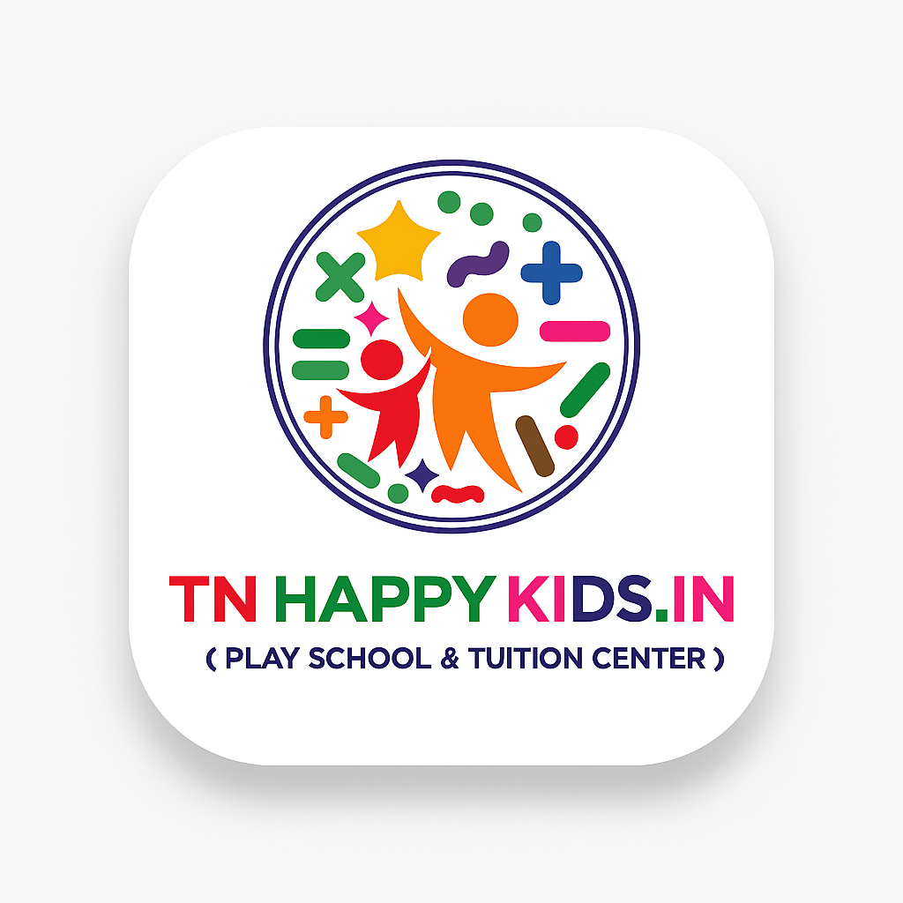

# 🎓 TN Happy Kids Playschool

A comprehensive mobile application for playschool management, built with React Native and Expo.



## 📱 Features

### 👨‍💼 **Admin Dashboard**
- User management (Students, Teachers, Franchisees)
- Branch management
- Live monitoring with camera feeds
- Income/Expense tracking
- Attendance management
- Push notifications

### 👨‍🏫 **Teacher Portal**
- Student attendance marking
- Timetable management
- Chat with parents
- Activity posting
- Live cab tracking

### 👨‍💼 **Franchisee Management**
- Branch-specific dashboard
- Student enrollment
- Staff management
- Financial reports

### 👨‍🎓 **Student Features**
- Virtual ID card
- Timetable viewing
- Profile management
- Chat functionality
- Cab tracking

### 👨‍✈️ **Captain Features**
- Student navigation
- Attendance tracking
- Route management

## 🚀 Tech Stack

- **Frontend**: React Native with Expo
- **Navigation**: Expo Router
- **Backend**: PHP APIs
- **Database**: MySQL
- **Authentication**: Session-based with tokens
- **Push Notifications**: Expo Notifications
- **Video Streaming**: YouTube, Twitch, MP4 support
- **Maps**: Location tracking and cab monitoring

## 📦 Installation

### Prerequisites
- Node.js (v18 or higher)
- Expo CLI
- EAS CLI
- Git

### Setup
```bash
# Clone the repository
git clone https://github.com/DineshWebDev2003/1up.git
cd 1up

# Install dependencies
npm install

# Start the development server
npx expo start
```

## 🔧 Build & Deploy

### Local Development
```bash
# Start development server
npm start

# Run on Android
npm run android

# Run on iOS
npm run ios

# Run on Web
npm run web
```

### Production Build
```bash
# Build for Android
eas build --platform android --profile production

# Build for iOS
eas build --platform ios --profile production

# Build preview APK
eas build --platform android --profile preview
```

## 🤖 CI/CD

This project uses GitHub Actions for automated building and deployment:

- **Triggers**: Push to main/master branch, Pull requests
- **Builds**: Android APK automatically
- **Artifacts**: APK files stored for 30 days
- **Releases**: Automatic releases on main branch pushes

### Required Secrets
Set these in your GitHub repository settings:
- `EXPO_TOKEN`: Your Expo access token
- `GITHUB_TOKEN`: Automatically provided by GitHub

## 📱 App Configuration

### App Details
- **Name**: TN Happy Kids Playschool
- **Package**: com.dineshwebdev.tnhappykidsplayschool
- **Version**: 1.0.0
- **Owner**: dineshwebdev

### Supported Platforms
- ✅ Android (API 21+)
- ✅ iOS (iOS 11+)
- ✅ Web (PWA)

## 🎨 UI/UX Features

- **Modern Design**: Purple-cyan gradient theme
- **Responsive**: Works on all screen sizes
- **Animations**: Smooth transitions with Lottie
- **Dark Mode**: Theme switching capability
- **Accessibility**: Screen reader support
- **Offline Support**: Basic offline functionality

## 🔐 Security Features

- Session-based authentication
- Token validation
- API rate limiting
- Input sanitization
- Secure file uploads

## 📊 Performance

- **Bundle Size**: Optimized with Metro bundler
- **Loading Time**: Fast startup with lazy loading
- **Memory Usage**: Efficient state management
- **Network**: Optimized API calls with caching

## 🐛 Bug Reports

Found a bug? Please create an issue with:
- Device information
- Steps to reproduce
- Expected vs actual behavior
- Screenshots if applicable

## 🤝 Contributing

1. Fork the repository
2. Create a feature branch
3. Make your changes
4. Test thoroughly
5. Submit a pull request

## 📄 License

This project is proprietary software developed for TN Happy Kids Playschool.

## 👨‍💻 Developer

**Dinesh Web Dev**
- GitHub: [@DineshWebDev2003](https://github.com/DineshWebDev2003)
- Email: dineshwebdev2003@gmail.com

## 📞 Support

For support and queries:
- Email: support@tnhappykids.in
- Phone: +91 9514900069

---

## 🚀 Quick Start Commands

```bash
# Install dependencies
npm install

# Start development
npx expo start

# Build APK
eas build --platform android --profile preview

# Deploy to GitHub
git add .
git commit -m "feat: update app features"
git push origin main
```

## 📈 Version History

- **v1.0.0** - Initial release with core features
- **v1.1.0** - Added live monitoring and fullscreen video
- **v1.2.0** - Enhanced UI/UX and performance improvements

---

**Built with ❤️ for TN Happy Kids Playschool**
